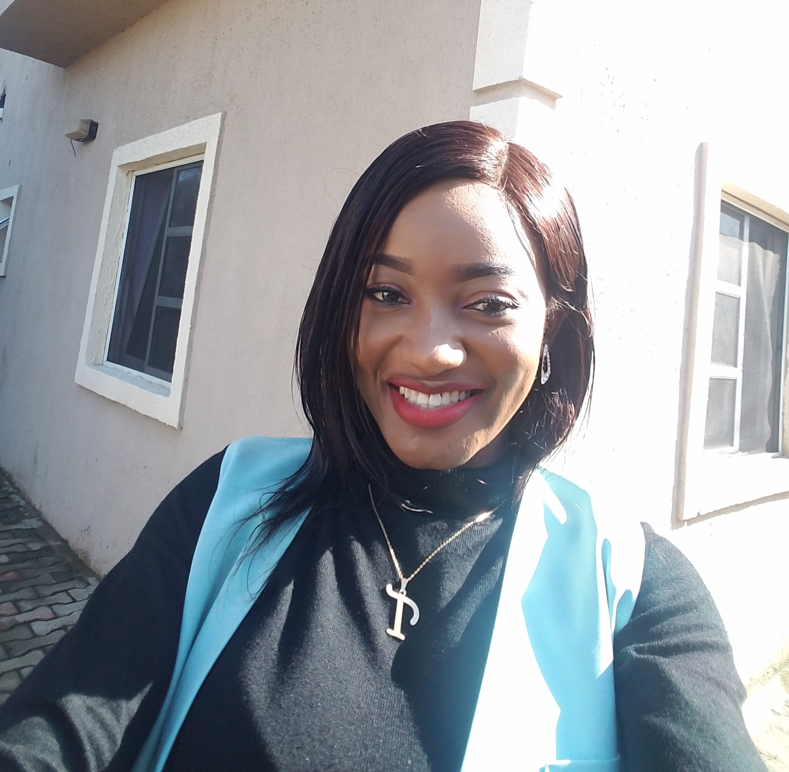

## Welcome to FOSS 2021 Team 2 Github Page!

### Team Members
Team members, biographies, and research interests

#### Ida Sami
text

#### Athan Walker

##### About...

**Major:** Computer Science

**Year:** 1st year MS Student in Computer Science

**Undergrad:** University of Arizona

**Hometown:** Tucson, Arizona

**Academic Interests:** Software engineering, parallel programming, high-performance computing, data management, data visualization

**Hobbies:** Guitar, basketball, gaming

**Fun fact:** Has pole-vaulted over 10 feet

#### Tina Fingesi

##### About me:

**Major:** Environmental Health Science; University of Arizona

**Year:** 1st year PhD student

**Undergrad:** University of Lagos

**Hometown:** Rivers state, Nigeria

**Academic Interests:** Air quality management, Exposure assessment, Bioremediation, HSE

**Hobbies:** Skating, dancing, sightseeing, working-out, photography

**Fun fact:** Won two gold medals in 4 by 400metres relay as an undergrad

#### Tristan Hites
text

#### Zeke Peterson
text
