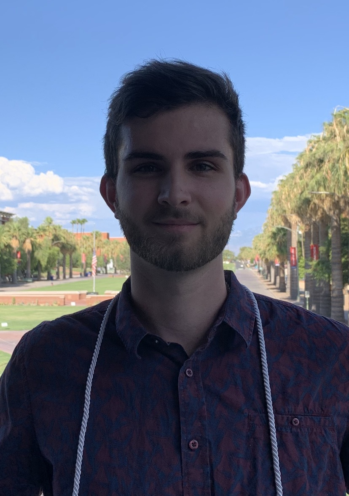

## Welcome to FOSS 2021 Team D Github Page!

### Our Capstone Project

In general, most of the disciplines our team members come from are new to the Open Science world, and it is a challenge to convince peers and researchers in our disciplines to adhere to these new principles. We are taking the first steps to bridge the gap between Open Science and FAIR principles and our current work research envirionments. We wanted our capstone to reflect some of the initial first steps we are all attempting to make in our own research. 

Ida Sami was the only one in our group working with data, so for our project we decided to move her data to the CyVerse Data Store. We are doing this so her research partners can easily access her data on the cloud. Before, they only used Excel and stored the data on their local machines. Now, with the Data Store, Ida and her research group can begin to incoperate Open Scince & FAIR Principles into her work.  

We also decided to all look through Ida's Data Management plan and provide feedback as a team. The data management plan is allowing Ida to share her research process with stakeholders involved in the research project. 

### Team Members
Team members, biographies, and research interests

#### Ida Sami

##### About...

**Major:** Arid Lands Resource Sciences GIDP

**Year:** 3rd year PhD Candidate

**Undergrad:** BSc in Architectural Engineering 

**Hometown:** Tabriz, Iran

**Academic Interests:** Urban Resilience, Urban Climate, Extreme Heat

**Hobbies:** Baking, Interior design, Walking

**Fun fact:** I love painting, and I paint portraits during my free time. 

#### Athan Walker

##### About me:

**Major:** Computer Science

**Year:** 1st year MS Student in Computer Science

**Undergrad:** University of Arizona

**Hometown:** Tucson, Arizona

**Academic Interests:** Software engineering, parallel programming, high-performance computing, data management, data visualization

**Hobbies:** Guitar, basketball, gaming

**Fun fact:** Has pole-vaulted over 10 feet

**FOSS Takeaways**
* **Docker containers:** Useful for mobilizing code and including dependencies all in one neat bundle. 
* **Data Management Plans:** DMPs are tough to incorporate into non-research based projects due to the habits of the team. One convincing argument is that a well organized DMP can assist with grants from project proposals, in addition to the FAIR principles that a DMP follows.
* **HackMD:** Real time collaboration is a sought out activity among collaborators. HackMD provides this in a markdown editor/result format. In real time users can edit in markdown and see the resulting page. The advantage of this over google docs is the customizable flexibility that markdown can provide over google docs.
* **GitHub Pages:** Delivers a free web page for users to take advantage of. Easily links to GitHub repositories and code.
* **CyVerse Datastore:** Great for structuring and storing large amounts of data, making them easily accessible.

The FOSS takeaways listed above are the skills and tools I learned from my time attending the FOSS workshop. Each are linked to the concept of FAIR science and can be utilized in all projects related to data. Some of these skills may suit some needs over others all build towards better science.

#### Tina Fingesi

##### About me:

**Major:** Environmental Health Science; University of Arizona

**Year:** 1st year PhD student

**Undergrad:** University of Lagos

**Hometown:** Rivers state, Nigeria

**Academic Interests:** Air quality management, Exposure assessment, Bioremediation, HSE

**Hobbies:** Skating, dancing, sightseeing, working-out, photography

**Fun fact:** Won two gold medals in 4 by 400metres relay as an undergrad

**FOSS TOOLS & IMPLEMENTATION**
As a beginner in Data/Open science, the FOSS program gave me hands-on knowledge in making my data FAIR. Some of the skills I find myself using immediately are:

**Data Management Plan through DS wizard:** The DMP gives me a good start-off point for my research. There are two faculty members and one PhD student in my lab team; with a thorough DMP I will be able to highlight the roadmap for the project which will make my project more collaborative with other members of the team

**CyVerse Data storage:** I will be collecting hourly air quality data during my field sampling and the data store is a more secure and accessible platform for me with large enough storage space for the quantity of data I will be uploading

**GitHub:** With GitHub, each member of the research team will have the opportunity to access the codes, make changes and altogether we will be able to keep track of these changes and versions. 

**HackMD:** With the HackMD we can discuss the progress of the research as a group and have real time collaboration

Other tools which I wish we covered more in depth or which I may need to study more and might at a later time find useful in my field of study are: Atmosphere, Jupyter Notebook, Shell/Linux Commandline

#### Tristan Hites

#### About...

**Major:** Public Policy 

**Year:** 1st Year Master's of Public Policy Student 

**Hometown:** Potlatch, Idaho

**Academic Intrests:** Environmental policy, impacts from invasive species, wildfire policy and management

**Hobbies:** Reading, being outdoors, exercising, watching YouTube

**Fun Fact:** Tristan has gone on three 50+ mile hikes and two 100+ mile canoe trips. 

**What I Plan to Implement from FOSS:** I am very new to open science, and this course has really opened my eyes to what I should be doing in my research and Master's of Public Policy program. As first steps to begin down the path to open science, I would like to implement three resources: GitHub, DSWizard, and CyVerse. For GitHub, I would like to make my own page to showcase my research, as well as host any code I use. For DSWizard, I am going to revamp my lab's current DMP using this tool and make it as FAIR as possible. Finally, for future projects I would like to use the CyVerse Data Store to hold all of my data to the cloud for myself and collaborators to use. These will be my first initial steps using open science skills and I hope to use more in the future. 

#### Zeke Peterson

**Program:** Third-year Law Student

[**Resume**](https://drive.google.com/file/d/1vvUP5BJhxXeU75vPZTiC8doSwjSDNv8Y/view?usp=sharing)

[**Legal Writing Sample**](https://drive.google.com/file/d/1BNFp4IiDwZ0IMDmuzIFsDYWJWjmYugoN/view?usp=sharing)

[**Academic Writing Sample**](https://drive.google.com/file/d/11dNV5cpmY9_jQA42R5iMyNwmvVnrImmt/view?usp=sharing)

**Experience and Research Interests:** Federal environmental law, Public land and natural resource management, Administrative law

**Undergrad:** B.S. in Chemical Engineering, University of Utah

**Hometown:** Missoula, Montana

**Hobbies:** Trail running, Skiing, Watching Minor League Baseball, Constructing crossword puzzles

**Fun Fact:** Zeke's favorite sandwich is a peanut butter, jelly, and huckleberry sandwich

